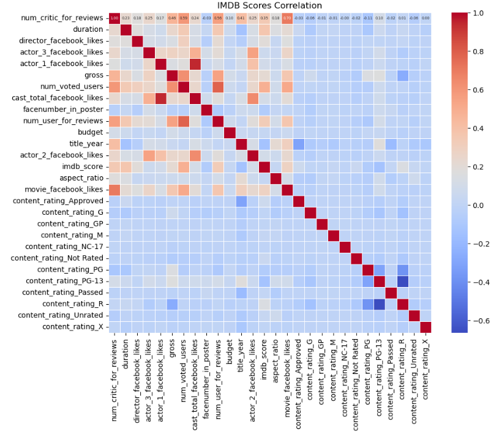
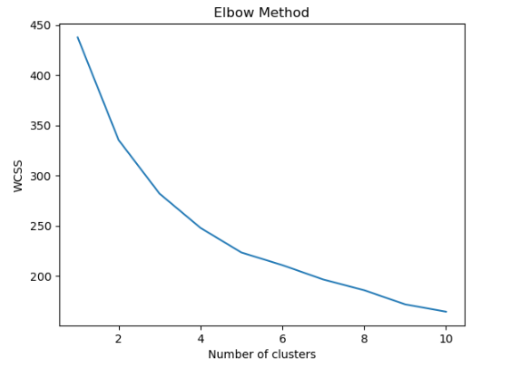

# Movie Rating Prediction Project

This project leverages machine learning techniques to predict IMDb movie ratings using various features such as the number of voted users, movie duration, and critic reviews. By conducting Exploratory Data Analysis (EDA), correlation analysis, regression analysis, classification, and clustering, the project aims to uncover patterns that can effectively predict and categorize movie ratings. The ultimate goal is to provide a data-driven approach to evaluate movie quality, offering a more objective and reliable guide for movie enthusiasts.

You can view the complete project [here](https://github.com/ty-russ/IMDB-Movies-analysis/blob/main/movies_analysis.ipynb).

## Project Overview

The main objectives of this project were:

1. **Exploratory Data Analysis (EDA):** To uncover patterns and insights from the dataset.
2. **Regression Analysis:** To predict IMDb scores based on various features.
3. **Classification Analysis:** To categorize movies into predefined IMDb score categories.
4. **Clustering Analysis:** To group movies based on similar characteristics.

## Data Overview

The dataset contains various features such as:

- Number of critic reviews
- Duration of the movie
- Director Facebook likes
- Actor Facebook likes
- Gross earnings
- Number of voted users
- Cast Facebook likes
- Number of user reviews
- Budget
- Title year
- IMDb score
- Aspect ratio
- Content rating

## Correlation Analysis

To understand the relationships between different features and the IMDb score, I calculated the correlation matrix. Key findings from the correlation analysis include:

### IMDb Score Correlations:

- **Number of Voted Users:** Strong positive correlation (0.48)
- **Duration:** Moderate positive correlation (0.37)
- **Number of Critic Reviews:** Moderate positive correlation (0.35)
- **Movie Facebook Likes:** Moderate positive correlation (0.35)



## Regression Analysis

### Models Used

1. **Linear Regression**
2. **Lasso Regression**
3. **Random Forest Regression**

### Performance Metrics

- **Mean Squared Error (MSE)**
- **R-squared**

### Results


- **Linear Regression:**
    - Mean Squared Error (MSE): 0.67
    - R-squared: 0.346
- **Random Forest:**
    - Mean Squared Error (MSE): 0.47
    - R-squared: 0.549
- **Lasso Regression:**
    - Mean Squared Error (MSE): 0.75
    - R-squared: 0.265

The Random Forest Regression model achieved the best performance, indicating it explained a reasonable amount of variance in IMDb scores. Other models had lower R-squared values, suggesting limited explanatory power for predicting IMDb scores.

## Classification Analysis

### IMDb Score Categories

Movies were categorized based on IMDb scores into:

1. Low (0-4)
2. Medium (5-7)
3. High (8-10)

### Models Used

1. **Logistic Regression**
2. **Support Vector Machine (SVM)**
3. **Random Forest Classifier**

### Performance

- **Logistic Regression Accuracy:** 82%
- **SVM Accuracy:** 85%
- **Random Forest Classifier Accuracy:** 91%

The Random Forest Classifier achieved the highest accuracy, demonstrating effective categorization of movies based on IMDb scores.

## Clustering Analysis

### Clustering Technique

- **K-means Clustering** was used to group movies based on features like IMDb scores, critic reviews, and release year.

#### Determining Optimal k Value

```python
# WCSS: Within cluster sum of squares 
wcss = []

for i in range(1, 11):
    kmeans = KMeans(n_clusters=i, 
                    init='k-means++',                     
                    n_init='auto', 
                    random_state=0)
    kmeans.fit(df_normalized)
    wcss.append(kmeans.inertia_)

# Plotting the results
plt.plot(range(1, 11), wcss)
plt.title('Elbow Method')
plt.xlabel('Number of clusters')
plt.ylabel('WCSS')
plt.show()

```


## K-means Clustering Code Snippet

Here is the code snippet for applying K-means clustering:

```python
from sklearn.cluster import KMeans

# Selecting features for clustering
features = movie_data[['imdb_score', 'num_critic_for_reviews', 'title_year', 'num_voted_users']]

# Applying K-means clustering
kmeans = KMeans(n_clusters=5, random_state=42)
clusters = kmeans.fit_predict(features)

# Adding cluster labels to the data
movie_data['cluster'] = clusters
```

## Clusters Identified

1. **Cluster 0:**
   - High IMDb score
   - High number of critic reviews
   - Recent title years
   - High number of voted users

2. **Cluster 1:**
   - Moderate IMDb score
   - Fewer critic reviews
   - Title year around 2009
   - Lower number of voted users

3. **Cluster 2:**
   - High IMDb score
   - Fewer critic reviews
   - High Facebook likes
   - Older title years (around 2000)

4. **Cluster 3:**
   - Low IMDb score
   - Low number of critic reviews
   - Mid-2000s title years
   - Low number of voted users

5. **Cluster 4:**
   - Moderate IMDb score
   - Low number of critic reviews
   - Title years around 1996


## Conclusion

The project successfully identified key factors influencing IMDb scores and demonstrated the effectiveness of machine learning models in predicting and categorizing movie ratings. Random Forest Regression emerged as the most reliable model for predicting IMDb scores, while the Random Forest classifier effectively categorized movies based on their success. Additionally, clustering analysis revealed distinct movie profiles, offering valuable insights for targeted marketing strategies. These findings underscore the potential of machine learning in enhancing the accuracy and reliability of movie rating predictions.

## Key Takeaways

- **Exploratory Data Analysis:** Identified important features affecting IMDb scores.
- **Correlation Analysis:** Factors such as the number of voted users, movie duration, and the number of critic reviews significantly impact the IMDb score.
- **Regression Analysis:** Random Forest Regression provided the best predictions.
- **Classification Analysis:** The Random Forest classifier effectively categorizes movies based on their success.
- **Clustering Analysis:** Movies can be grouped into distinct clusters with unique profiles, providing insights into different success factors.

Thank you for exploring this project. Feel free to check out the detailed code and analysis in the [notebook](https://github.com/ty-russ/IMDB-Movies-analysis/blob/main/movies_analysis.ipynb).

## Technologies Used

- **Python:** Pandas, NumPy, Scikit-learn, Seaborn, Matplotlib
- **Machine Learning:** Decision Tree, Random Forest, Linear Regression
- **Data Visualization:** Matplotlib, Seaborn
